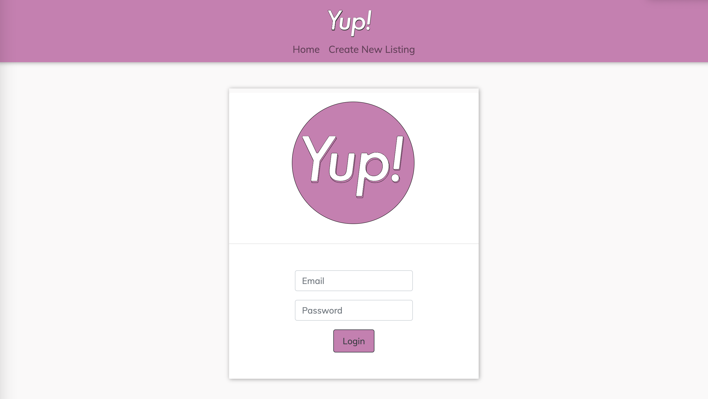

# Yup Schlepp/ yup-schlepp

[](https://opensource.org/licenses/MIT)

- [Repo](https://github.com/yondav/yup-schlepp)

## About / Synopsis

Yup Schlepp is the beginning of an intensive project revolving around the needs of your average NYC leasing agent. The goal is to build a full force CRM over time, specific to the needs of Yup Realty, LLC.

In our first version we present the ability to add and edit listings through their numerous data points spanning from data that corresponds to the landlord, building, unit, amenities, location, etc.

While we have the ability to delete from the database and our routes, we don't offer it through the UI. We chose to deliver the initial version this way with purpose. We don't encourage agents to remove listings from the database. Instead we encourage agents to mark the unit's status to show it's availability. Apartments come back on the market on a yearly basis and we want to offer ease of renewing listings with all of their corresponding data when units come back on the market.

[Express](http://expressjs.com/) server supports `GET`, `POST`, `PUT`, `PATCH` and `DELETE` requests.

---

## Table of contents

> - [Title / Repository Name](#title--repository-name)
>   - [About / Synopsis](#about--synopsis)
>   - [Table of contents](#table-of-contents)
>   - [Installation](#installation)
>   - [Usage](#usage)
>     - [Config](#config)
>     - [Schema](#schema)
>     - [Seed](#seed)
>     - [Start Server](#start-server)
>   - [Author](#author)
>     - [Contact](#contact)
>   - [Contributing / Issues](#contributing--issues)
>     - [Contributing](#contributing)
>     - [Reporting Issues](#reporting-issues)
>   - [Technologies](#technologies)
>   - [License](#licenses)

---

## Installation

- Clone repo
- Open integrated terminal on the root directory
- Install dependencies :

```
npm i
```

---

## Usage



### Authentication

- this is an internal application for Yup Realty LLC. Functionality is not accessible without authentication.

For Demoing:

```
email: agent@yupny.com
password: password
```

### Views & Queries


- The following query example will return all apartments within the price range of $1000 and $3000 in Bushwick with at least one bedroom, a balcony and permits pets:

```
http://127.0.0.1:8080/results/units/?unit[legal_beds=1]&unitAmenities[balcony]=true&unitAmenities[city_view]=true&building[neighborhood]=Bushwick&buildingAmenities[pets_allowed]=true&unit[__gte_gross_rent]=1000&unit[__lte_gross_rent]=3000
```

### Add & Edit Listings


- Add and edit listings in the database

---

### Config

Configure `.env.EXAMPLE`

- rename file to `.env`

```
DB_NAME=yup_db
DB_USER=<sql_username>
DB_PW=<sql_password>

// Cloudinary config

CLOUD_NAME=<cloudinary_account>
CLOUD_KEY=<cloudinary_key>
CLOUD_SECRET=<cloudinary_secret>

// Google API Key
GKEY=<google_API_key>

```

---

### Schema

`db` directory holds `schema.sql` with script to create database in Workbench or from the command line.

---

### Seed

`seeds` directory holds placeholder data to seed the database. Data can be changed to suit users needs or preference.

```
npm run seed
```

---

### Start Server

```
npm start
```

for `nodemon server.js`:

```
npm run watch
```

---

## Contributors

### Yoni David

- <a href="https://yondav.us/">Portfolio</a>
- <a href="https://github.com/yondav">Github</a>

### Tomek Regulski

- <a href="https://tomekregulski.github.io/portfolio/">Portfolio</a>
- <a href="https://github.com/tomekregulski">Github</a>

### Lauren Drew

- <a href="https://lawriedrew.github.io/Professional-Materials/">Portfolio</a>
- <a href="https://github.com/LawrieDrew">Github</a>

### Neil Creveling

- <a href="https://neilcreveling.github.io/Updated-Portfolio/">Portfolio</a>
- <a href="https://github.com/neilcreveling">Github</a>

---

### Contact

Inquiries can be sent to [info@yupny.com](mailto:info@yupny.com)

## Contributing / Issues

---

### Contributing

- Fork repo
- Make additions and changes on new, personalized branch
- Submit [pull request](https://github.com/yondav/yup-schlepp/pulls)

---

### Reporting Issues

Report issues by selecting the [issues](https://github.com/yondav/yup-schlepp/issues) tab and creating a new issue

---

## Technologies

- [MySQL](https://www.mysql.com/)
- [Sequelize](https://sequelize.org/)
- [Multer](https://www.npmjs.com/package/multer)
- [Cloudinary](https://cloudinary.com/)
- [Streamify](https://www.npmjs.com/package/streamify)
- [Bcrypt](https://www.npmjs.com/package/bcrypt)
- [Bootstrap](https://getbootstrap.com/)
- [Font-Awesome](https://fontawesome.com/)

## Licenses

- [MIT](https://github.com/yondav/13-e-commerce-back-end/blob/main/LICENSE)

This README file was built with [README Generator](https://github.com/yondav/README-gen-09)

Copyright &copy; 2021, Yup Realty, LLC
